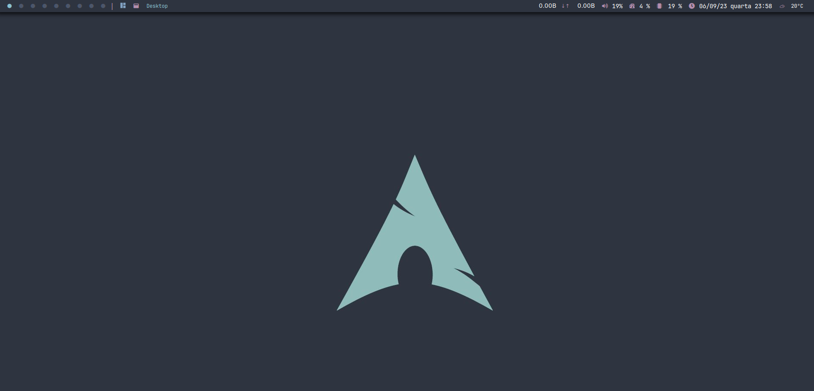

# qtile-yt

**Fonts:**
* Fira Code Nerd
* Jetbrains Mono Nerd
* Font Awesome 5

**Dependências:**
* qtile
* python-psutil
* python-setuptools
* qtile-extra
* alacritty
* rofi
* mousepad
* firefox
* thunar
* thunar-achive-plugin
* thunar-volman
* flameshot
* amixer
* ttf-firacode-nerd
* ttf-jetbrains-mono-nerd
* gnome-keyring
* xclip
* picom
* xfce4-notifyd
* xfce4-power-manager
* ttf-font-awesome-5
* btop
* pavucontrol
* sddm-git
* sddm-sugar-candy-git
* neofetch
* nordic-theme
* nordzy-icon-theme
* lxappearance
* viewnior
* mpv
* neovim
* ranger
* feh

**Install:**
`yay -S - <packages.txt`

**Set SDDM Theme:**
`sudo cp sddm.conf /etc/sddm.conf`
